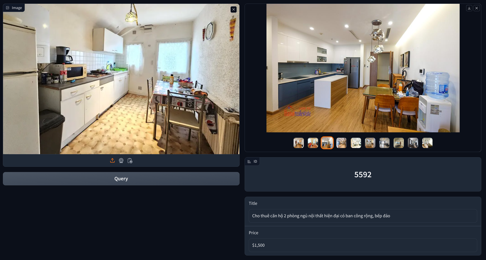
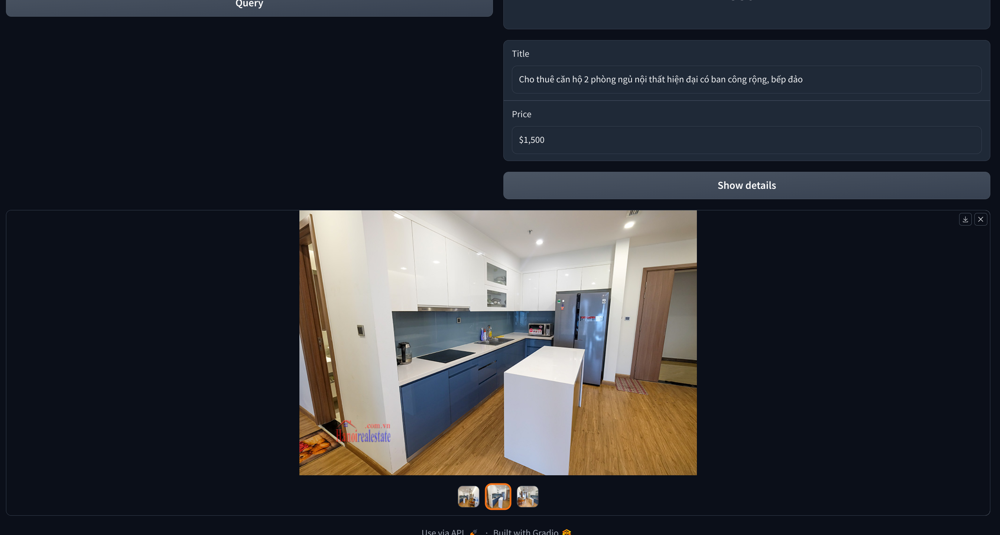

# Estate Semantic Search - Introduction to Big Data [SOICT - HUST] [Project]

## Overview


## Getting Started

### Prerequisites

- Docker & Docker Compose (https://docs.docker.com/engine/install/ubuntu/)
- Python 3.8 - Recommend using Miniconda (https://docs.conda.io/en/latest/miniconda.html)
- Install Python Requirements 
```bash
pip install -r requirements.txt
```

### Run

0. Git clone this repo
```bash
git clone https://github.com/toilaluan/bigdata-hust
```
1. Start Docker Composes:
- Kafka + Zookeeper: `sudo docker compose -f kafka/docker-compose.yml up -d`
- Minio nodes: `sudo docker compose -f minio/docker-compose.yml up -d`
- Weaviate: `sudo docker compose -f weaviate_estate/docker-compose.yml up -d`

2. Start Weaviate Consumer:
```bash
python weaviate_estate/consumer.py
```

3. Start Minio Consumer:
```bash
python minio/consumer.py
```

4. Start Kafka Producer:
```bash
python kafka/producer.py
```
Kafka Producer will automatically start push crawled data from https://hanoirealestate.com.vn/vi/ to Kafka.

5. Start App:
```bash
python weaviate_estate/app.py
```
Access app ui at: http://localhost:7860

#### Upload an image and query similar images - Weaviate


#### Select an item and query Minio for all images

